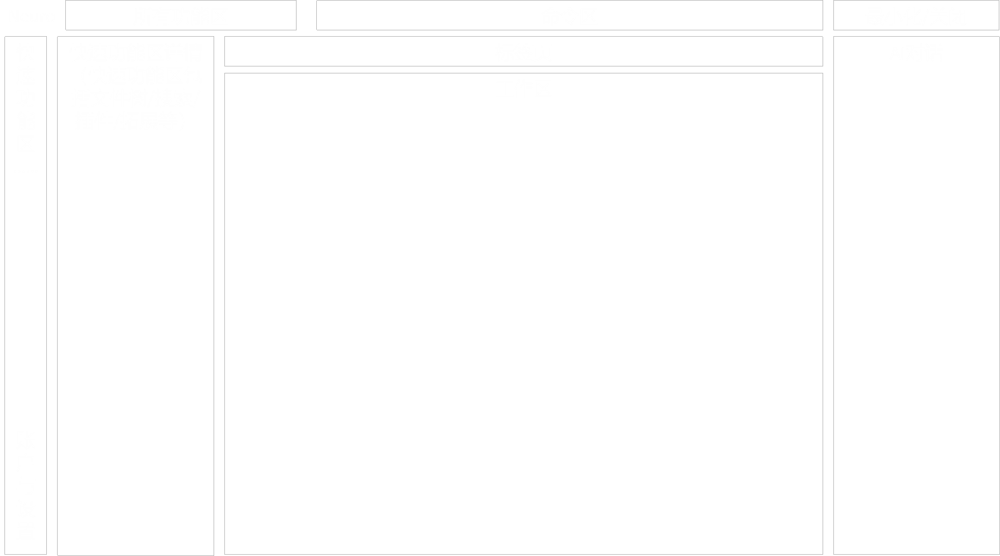

我觉得我们的Nuero项目不应该局限于zotero/obsidian的链接的插件，我们要创建一个完整的独立的软件。但是要求如下：

1.我们提到的类似zotero connector的浏览器插件，我们的可以叫Neuro connector，当我们浏览网页时会出现在浏览器的插件栏，点击即可以可以做到网页/文献/视频等信息的抓取与条目自动保存，同时在保存时点击更多内容用户还可以输入条目命名/标签/简记等信息，我们以网站1，文献1，视频1举例。

2.当用户新建一个Nuero项目1，这时候系统会自动创建项目1/Entry文件夹，第1步中的原始信息将会保存到Nuero软件的项目1文件夹下的Entry文件夹中保存（保存格式可以参考zotero），比如文献1会保存PDF/文献原文网页链接/文献条目信息到Entry/文献1，网站1会保存网站链接/网站条目信息/网站截图（可选），视频1会保存视频链接/视频条目信息。如果我们的用户比较有文件管理意识，创建了Entry/文献分类1和Entry/文献分类2，我们的Nuero在保存时同样会在Entry下创建文献分类1和文献分类2文件夹，分别保存不同文献，以此类推最多三层。

3.在Neuro的应用界面中我们首先会进入Entry模式（也就是项目源文件管理功能），在这个模式下我们集成了PDF阅读器/翻译器/视频浏览/网页跳转/网页文字与图片爬取导出等功能，同时还需要预留接口交给开源社区设计相关功能的插件（比如中英对照翻译/添加更多标签等功能），我们会将这些文件保存在与第2步中相同的文件夹目录下。同时我们在Entry模式中允许用户上传PPT/PDF/MP4等文件，并且自动为用户创建条目文件，允许用户自由移动条目位置，为其设置标签等。

4.这时候我们启用AI主导的主节点markdown文件生成功能，把上述的条目信息转化为主节点markdown格式，主节点markdown文件里包含如下内容：类似zotero中的条目报告生成功能生成的条目报告中的内容其实就是我想的主节点应该出现的内容，包括条目类型（网页/文件/文献，其中文件又细分为PDF，PPT，MP4等），条目名称（比如视频标题/文献标题/网页标题等），作者，摘要，日期，DOI，引用关键词，网址，访问时间，语言，文库编目，卷次，页码，出版物，ISSN，刊物，添加日期，修改日期，用户导入时创建/在Entry中修改的标签（这里的标签可以用于后续可视化的呈现，详情见第9点），用户导入时创建/在Entry中修改的笔记，附件目录。但同时主节点markdon文件里还需要额外包括附件的跳转链接，即上述的各类PDF/图片/网页链接/笔记等文件条目信息及跳转链接，我在PDF中划线做的笔记的原文及跳转链接等。这里的链接不仅承载着打开对应文件的功能，同时向Nuero说明了这些文件之间的关联性，这是参照obsidian的外部链接和关系导图的精髓。上述的markdown文件生成以后，将保存在Entry模式导入时同一的目录下。同时，我们提到了Neuro可以作为一个项目管理器，这一点也是通过在主节点markdown文件中添加各种信息链接来实现的，详情见第6点。

5.Entry模式编辑完成之后，我们将进入本项目最具特色的thinking模式（或者叫AI打标）。顾名思义，thinking模式的核心功能是接入claude code等AI agent帮助-管理文献。点击开始理解，首先每个主节点的markdown文件是AI的首要阅读与理解文件，因为这是每一个项目条目的总结性文件，并且还内置了可以查询的项目条目附件的跳转链接，同时兼顾了AI的查询效率与准确度。如果AI需要进一步查询可以打开跳转链接进一步理解。为了节省token，如无必要，AI不会主动打开跳转链接对应文件。

6.在thinking功能下，我们的AI还会自主分析，在视频的关键内容处进行截图和图片保存在Entry中的视频项目同文件夹下，并且把跳转链接（图片较大/视频片段）或者图片原件（图片足够小）添加在markdown文件里；或者对文献进行总结与分析生成简记内容添加在markdown文件里；又或者对网页提取关键的时间等信息保存在markdown文件里。进一步完善主节点markdown文件。同时，为了实现本项目最强大的拓展性与功能性，在这里的thinking模式下，AI还可以对markdown文件进行修改，为后续的项目管理功能提供接口。（这里允许AI打标的作用为后续的项目可视化与AI项目管理功能服务）

6.前文提到我们的Neuro还可以作为一个项目管理工具。具体实现方式如下：因为是项目管理工具，可能用户编辑项目的方式不是运用Neuro connectoc插件在浏览器中抓取信息，而是直接在Entry模式里进行项目任务的布置。我们会为用户提供一个创建项目任务按钮，点击后会在用户选中的目录下自动创建一个具有模板格式的主节点markdown文件，用户此时在里面按模板填写任务；类型，负责人，任务前提条件（当前任务前置任务），任务开始持续时间，任务重要性，任务内容，任务完成进度（在下文每一个任务前放置勾选框，完成了就勾选），任务核验情况等信息。同时接入AI，允许用户通过对话让AI分析拆解任务并自动填写上述信息。当然这里还要留下运行开源插件修改模板的接口，运行开源插件添加更多的信息，这样也许Neuro会拥有更强大的功能

7.至此为止，Neruo 的基础内容已经搭建完毕。关于Neruo的前端设计，如图所示：

8.关于AI对话，首先我们的Neuro允许接入AI agent，我们向Agent直接询问，AI会优先查询用户选中的当前目录下已完成AI打标也就是thinking之后生成的对应条目下的主节点markdown文件。这时候用户可以提问问题，Agent将以本目录为重要数据库，同时辅以联网搜索功能，为用户呈现最佳的回答。此外，用户可以在此处进一步命令Agent主节点markdown文件的打标工作，比如为文件添加关键参数打标。以神经电极领域论文为例，ai会首先阅读第4步的markdown文件的摘要在markdown文件中搜索关键参数信息，比如电极制备的材料/电极阻抗/电极修饰材料/修饰后的阻抗等关键参数信息，同时AI会查询

9.现在开始Neruo最惊艳的知识可视化呈现的部分，也就是Neuro connector-Entry-thinking-print-follow的print模式。由于前文提到了我们对Neuro connector抓取到的文献条目以及用户手动在Entry中创建的任务都设置了主节点markdown文件，并且markdown文件中模板化的标注化的设置了或人为或AI的查询标签（即打标）。这时候我们以markdown的跳转链接以及打标标签为准，进行结合AI的可视化呈现。可视化类型1：树状图呈现，比如对于脑类器官多模态神经电极研究方向，ai首先会判断该研究方向的组成部分，如脑类器官培养-神经电极制备-多模态检测模块集成-信号采集与分析算法几部分，并根据markdown文件中的标签自动把文献条目进行归类并呈现为树状图，后续根据标签细分在树状图进一步长出枝丫。可视化类型2：像甘特图/流程图或者飞书的任务视图一样，比如在文件的markdown中填写任务相关信息（详情见第6点），我们可以通过统计标签可视化呈现任务完成情况与任务计划。同时需要注意，我们的可视化与市面上常见的甘特图流程图不同，还需要包括任务完成情况，任务重要性，任务前置任务等特色功能，呈现出有颜色有进度条有类似RPG游戏成就系统的多信息可视化任务图。这个功能不仅可以用于任务管理，只要主节点markdown标签设置得当，还可以作为你的竞赛流程提醒员，旅游路线规划师等综合秘书大脑。当然可以预留插件接口，探索更多的可视化图样类型。

10.接下来我们进入本项目最具决定性创造性的follow模式，follow模式其实可以理解为AI驱动的自动反馈式的thinking与print模式。接入AI agent管理你的文献条目内容，让Neuro成为你的第二大脑（Your Second Brain）。当我建立起上述的以主节点markdown文件为索引的的项目管理中心后，我希望AI可以自主管理我的项目中心，达到以下的效果：1.以文献科研为例：首先我阅读文献，建立了项目管理中心。基于此我确立了研究方向与研究计划，并将研究计划同步至该项目管理中心中（详情见第6点）。我向AI汇报我的每日任务完成情况与实验数据，AI会及时记录我实验中关键参数与指标的完成情况，首先会在项目管理中心的任务管理中修改主节点的markdown文件标签以进行任务进度的更新同步与可视化。此外，用户可以让AI在其检索的论文中建立一个关键数据排名表（关键数据依旧源于主节点markdown文件的AI打标，详情见第8点），之后把用户当前参数加入其中进行实时的对比。甚至有的论文中因为测量方法器件形态等其它参数的不一样导致参数没有进行统一标准下测量，AI还会在第8步的AI打标流程中自动统一标准与计量单位之后再统一建立数据排名表。这样我每天做完实验，看着ai在我的项目管理中心上打上大大的已完成，看着我的最佳数据更新了，并且在数据排名表上获得了提升，非常有干劲。同时我也非常喜欢看更多的论文，搜集更多数据。同时让我对整个研究领域有更直观的认识，同时也便于我撰写综述等研究报告，对我的科研生活有巨大的帮助。2.以旅游为例，AI首先基于Neuro connectorzz抓取到的旅游攻略信息建立主节点markdown文件，之后进行分析为用户推荐旅游计划，经由用户修改确认后进一步完善主节点markdown文件，形成项目管理中心，生成可视化任务表。AI可以根据用户的汇报实时更新旅游准备情况以及旅游进度，做用户的小导游。

11.我们的follow模式可以进一步强化，让AI直接接入电脑/手机等相关设备，查看你打开了哪些软件编辑了什么文件去了哪些地方，根据上述的数据实时分析总结推断用户当前正在进行的任务以及完成情况，并且提醒用户哪些重要任务还没做完。可能面临着一定的安全与伦理问题
